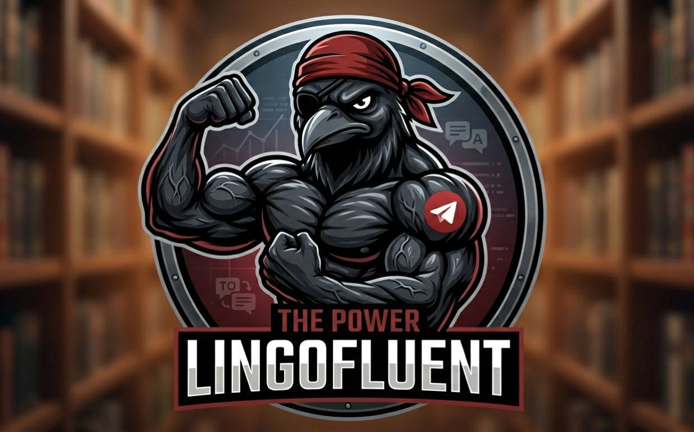
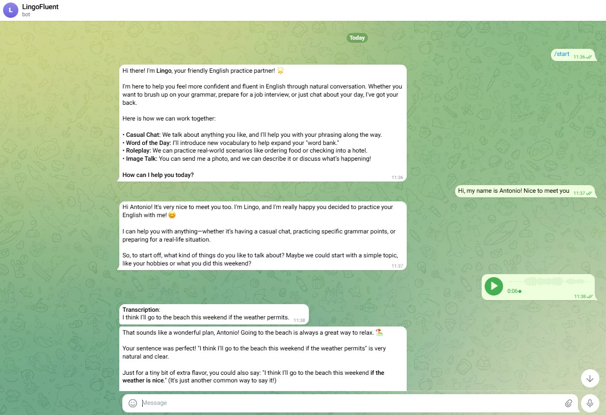
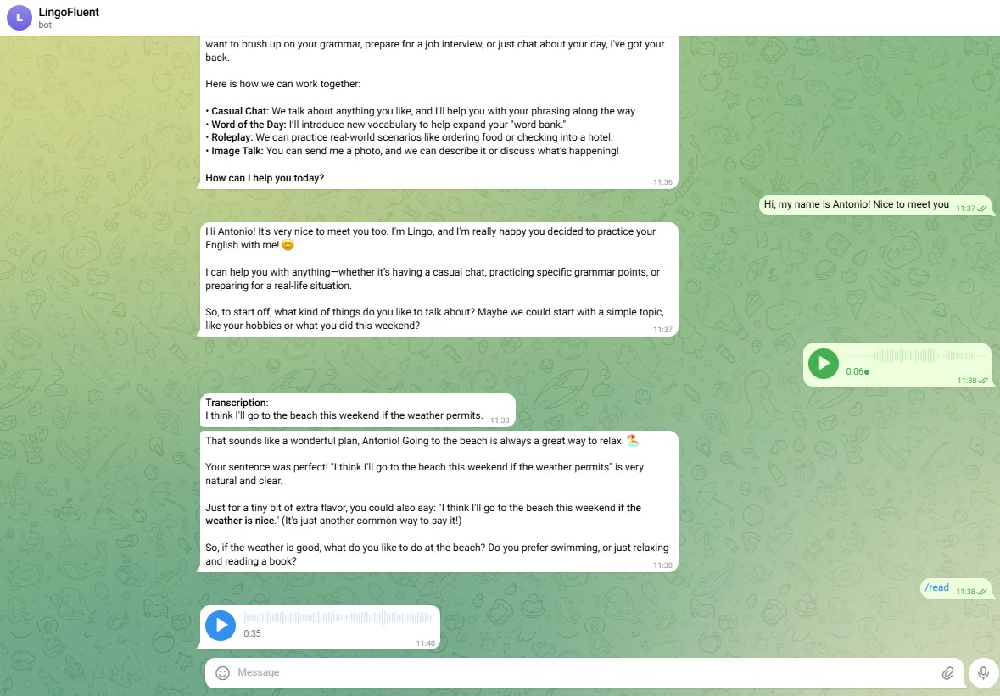

# Lingofluent




Lingofluent is a personal Telegram bot for language learning. It acts as an AI conversation partner powered by a local LLM (or any OpenAI-compatible backend), helping you practice a target language through real chat exchanges.

<p align="center">
  
  &nbsp;&nbsp;
  
</p>

**Key features:**

- **Conversation practice** — chat freely in text; the bot replies in the target language and can correct or explain your mistakes based on the system prompt you configure.
- **Voice input** — send a voice message and it is automatically transcribed via [CrispASR](https://github.com/CrispStrobe/CrispASR) before being passed to the LLM.
- **Image understanding** — attach a photo with a caption; the bot can describe, discuss, or use it as a conversation prompt (requires a vision-capable model).
- **Text-to-speech output** — the `/read` command reads any text back to you as a voice message using the CrispASR TTS backend.
- **Persistent history** — conversations are stored in a local SQLite database, surviving restarts; `/reset` starts a fresh session while keeping the old one for audit.
- **Swappable LLM** — the abstract `LLMBackend` makes it trivial to switch between a local llama.cpp server, OpenAI, or any custom provider.

The bot is designed to run privately: it accepts messages only from a whitelist of Telegram user IDs, refuses group chats and anonymous posts, and stores everything locally.

---

## Setup overview

The full setup has four one-time steps and one recurring step to start servers:

1. [Clone and install](#1-clone-and-install)
2. [Configure the Telegram bot](#2-configure-the-telegram-bot)
3. [Build CrispASR](#3-build-crispasr-voice--tts)
4. [Download models](#4-download-models)
5. [Start servers and run the bot](#5-start-servers-and-run-the-bot) ← repeat every time

> **Running on Windows?** Run steps 3–5 inside **WSL** (Ubuntu).

---

## 1. Clone and install

### Prerequisites

- **Python 3.10+**
- **ffmpeg** — `sudo apt install ffmpeg` (Linux/WSL) or Homebrew on macOS
- **Docker** + **NVIDIA Container Toolkit** — required to run the LLM server on GPU
- **cmake** + **build-essential** — required to build CrispASR

### Clone

```bash
git clone https://github.com/<your-username>/lingofluent.git
cd lingofluent
```

### Create a Python environment

**venv:**

```bash
python -m venv .venv
source .venv/bin/activate    # Linux / macOS / WSL
.venv\Scripts\Activate.ps1   # Windows PowerShell
```

**conda:**

```bash
conda create -n lingofluent python=3.10 -y
conda activate lingofluent
```

### Install the package

```bash
pip install -e .
```

All runtime dependencies (`python-telegram-bot`, `python-dotenv`, `aiohttp`, `pydub`) are declared in `pyproject.toml` and pulled in automatically.

---

## 2. Configure the Telegram bot

### Create the `.env` file

Copy the template and fill in your values:

```bash
cp template.env .env
```

### Create the bot with BotFather

1. Open Telegram and search for [`@BotFather`](https://t.me/BotFather).
2. Send `/newbot` and follow the prompts (name + unique `@username` ending in `bot`).
3. BotFather replies with an **HTTP API token** — copy it into `BOT_TOKEN` in `.env`.
4. Recommended hardening:
   - `/setprivacy` → **Enable** (the bot can't read group messages it isn't mentioned in).
   - `/setjoingroups` → **Disable** (nobody can add the bot to groups).

### Get your `USER_ID` and `CHAT_ID`

Use [`@userinfobot`](https://t.me/userinfobot): open it in Telegram, send `/start`, and it replies with your numeric user ID (e.g. `530253215`). Put that number in **both** `USER_ID` and `CHAT_ID` in `.env` — in a 1:1 DM with a bot, `chat.id == user.id`.

### Choose your LLM backend

**Option A — local Gemma model (default, GPU required):**

```env
LLM_TYPE=llama_cpp
LLM_BASE_URL=http://localhost:8000
```

**Option B — OpenAI:**

```env
LLM_TYPE=openai
OPENAI_API_KEY=sk-...
```

For any OpenAI-compatible server (vLLM, Azure, etc.) also set `LLM_BASE_URL`.

---

## 3. Build CrispASR (voice + TTS)

CrispASR provides speech-to-text and text-to-speech. Build it once from source.

```bash
sudo apt update
sudo apt install -y build-essential cmake git ffmpeg

git clone https://github.com/CrispStrobe/CrispASR.git ~/CrispASR
cd ~/CrispASR
```

**CPU build:**

```bash
cmake -S . -B build
cmake --build build -j$(nproc)
```

**GPU build (CUDA):**

```bash
cmake -S . -B build -DGGML_CUDA=ON
cmake --build build -j$(nproc)
```

The binary will be at `~/CrispASR/build/bin/crispasr`.

> If CrispASR is in a different location, set `CRISPASR_DIR` before running the scripts:
> `export CRISPASR_DIR=/path/to/CrispASR`

---

## 4. Download models

Run the download script from the repo root. It requires the `hf` CLI:

```bash
pip install huggingface_hub
hf auth login   # paste your Hugging Face token when prompted

bash scripts/download_models.sh
```

This downloads:
- **Gemma-4-E2B** (Q5_K_S quantisation + vision projector) → `~/llama/models/gemma-4-E2B-it/`
- **Parakeet TDT 0.6B** (ASR model) → `~/CrispASR/`

The TTS model (Qwen3-TTS, ~1.3 GB) is downloaded automatically on first use when the TTS server starts.

---

## 5. Start servers and run the bot

### Start all backend servers

```bash
bash scripts/start_servers.sh
```

This starts three servers in the background:

| Server | Backend | Port |
|---|---|---|
| LLM | llama.cpp (Docker) | 8000 |
| ASR | CrispASR / Parakeet | 8080 |
| TTS | CrispASR / Qwen3-TTS | 8081 |

Other commands:

```bash
bash scripts/start_servers.sh status   # check what's running
bash scripts/start_servers.sh stop     # stop all
```

Logs are written to `logs/` in the repo root.

### Start the bot

```bash
python -m lingofluent
```

---

## Text-to-speech voice setup (optional)

The `/read` command speaks text back to you using a cloned voice. To set one up, see [`voices/README.md`](voices/README.md).

Quick summary:
1. Place a 5–15 s, 24 kHz mono 16-bit WAV in `voices/` (e.g. `voices/antonio.wav`) with a matching `.txt` transcription (`voices/antonio.txt`).
2. Set `TTS_VOICE=antonio` in `.env`.
3. Restart the TTS server.

---

## LLM backends

### Local (default): Gemma via llama.cpp

Handled automatically by `start_servers.sh`. The model runs inside a Docker container on port 8000.

To change context size or GPU layers, set `CONTEXT_SIZE` or `GPU_LAYERS` before running the script:

```bash
CONTEXT_SIZE=8192 GPU_LAYERS=40 bash scripts/start_servers.sh
```

### Cloud: OpenAI or any OpenAI-compatible API

```env
LLM_TYPE=openai
OPENAI_API_KEY=sk-...
```

No local server needed. The bot routes calls to `gpt-4o` by default. Override with `LLM_BASE_URL` (for Azure, vLLM, etc.) or `OPENAI_MODEL`.
